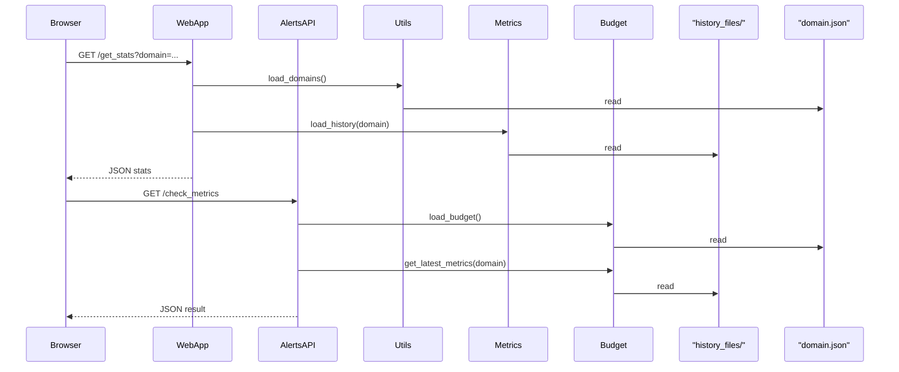

# Request Flow

This document outlines how client requests are processed by the service.

## Overview
The application is a Flask web server. Users access endpoints through their browser. The main entry point is `webapp.py` and the alerts API in `alerts_api.py`. Helper logic lives in modules under `modules/`.

The application stores configuration in `domain.json` and keeps metric history files in the `history_files/` directory.

## Sequence

The same helpers are used by other `webapp.py` routes (e.g., `/reset_history`) to write or remove files in `history_files/`.

